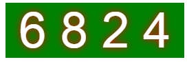

<h2>jQuery.imgCode.js一个基于JQUERY实现的图形验证码插件 </h2>
核心功能是HTML5的canvas画布的画图功能 

<h3>使用js验证码的场景：</h3> 
1、为了减少http请求、提升性能 
2、浏览器必须支持canvas标签 

<h3>使用说明：</h3> 
1、首先必须引入JQuery  
2、必须挂载在一个img标签上面  

<h3>基本用法：</h3> 
<pre>
img src="" id="app" 
$("#app").imgcode(); 
</pre> 

2行代码这样就搞定一个基本的验证码功能 
<h3>预览效果</h3> 
 

</pre> 
<h3>参数列表说明：</h3> 
<pre style='font-size: 16px;'>
numberSize  //设置验证码位数，默认4位 
textStyle  //验证码的样式 值为("fillText","strokeText"),默认 "fillText" 
textColor  //验证码颜色 默认 "#ffffff" 
shadowBlur  //阴影值 默认"0" 
shadowColor  //阴影颜色 默认null 
gradient  //背景是否渐变 默认"false" 
gradientColor  //渐变颜色设置 默认"['red','green','blue']" 也可以是十六进制颜色值如："gradientColor:['#E33127','#FE4735','#FFB37F']" 
mix   //是否启用数字和字母混淆 默认"true" 
mixNumber  //干扰圆点的数量 默认"100" 
mixLine  //干扰线的数量 默认"10" 
isCodeString  //验证码是否的纯字母 默认"false" 开启了mix之后无效 
isCodeNumber  //验证码是否的纯数字 默认"false" 开启了mix之后无效 
canvasOption:{  //验证码图片的宽高 
	width:130,  //默认 130
	height:40	//默认 40
} 
callback(n) //回调函数 参数 "n" 验证码字符串 (一般在里面执行ajax操作,把验证码发送给后台)

</pre> 
<h3>预览效果</h3> 
 
 
 

